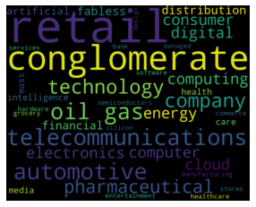
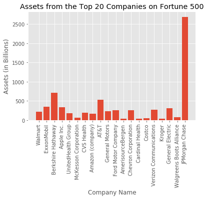

In this section, we will clean, join perform some basic analysis on the data to answer a few questions.


```python
import re, json
import itertools
from pathlib import Path
from wordcloud import WordCloud
import matplotlib.pyplot as plt
from IPython.display import Image

%matplotlib inline
plt.style.use('ggplot') # setting the style to ggplot
```


```python
fname = 'fortune_500_companies.csv' # scrapped data from previous section
path = Path('../data/')             # path to the csv file
df = pd.read_csv(path/fname)        # reading the csv file as a pandas df
df.head()                           # displaying the first 5 rows
```

 For this excercise, we will primarily focus on :
 - `products` 	
 - `industries` and 	
 - `assets`


```python
with open('../data/infoboxes.json', 'r') as file:
    wiki_data = json.load(file)
```


```python
wiki_data[0]
```


    {'founder': '[[Sam Walton]]',
     'location_country': 'U.S.',
     'revenue': '{{increase}} {{US$|514.405 billion|link|=|yes}} (2019)',
     'operating_income': '{{increase}} {{US$|21.957 billion}} (2019)',
     'net_income': '{{decrease}} {{US$|6.67 billion}} (2019)',
     'assets': '{{increase}} {{US$|219.295 billion}} (2019)',
     'equity': '{{decrease}} {{US$|79.634 billion}} (2019)',
     'type': '[[Public company|Public]]',
     'industry': '[[Retail]]',
     'products': '{{hlist|Electronics|Movies and music|Home and furniture|Home improvement|Clothing|Footwear|Jewelry|Toys|Health and beauty|Pet supplies|Sporting goods and fitness|Auto|Photo finishing|Craft supplies|Party supplies|Grocery}}',
     'num_employees': '{{plainlist|\n* 2.2|nbsp|million, Worldwide (2018)|ref| name="xbrlus_1" |\n* 1.5|nbsp|million, U.S. (2017)|ref| name="Walmart"|{{cite web |url = http://corporate.walmart.com/our-story/locations/united-states |title = Walmart Locations Around the World – United States |publisher = |url-status=live |archiveurl = https://web.archive.org/web/20150926012456/http://corporate.walmart.com/our-story/locations/united-states |archivedate = September 26, 2015 |df = mdy-all }}|</ref>|\n* 700,000, International}} {{nbsp}} million, Worldwide (2018) * 1.5 {{nbsp}} million, U.S. (2017) * 700,000, International',
     'company_name': 'Walmart'}


We can observe that we need to :
- Remove "[[" and "]]" 
- Remove "{{" and "}}"
- Split and seperate by the delimiter "|" in case of `products`
- Only keep alphanumeric and "-" characters

### What type of products are sold by the top 20 companies?

Let's define a few regular expressions to perform the above.


```python
regex1 = re.compile('[\{\[]+(.*?)[\]\}]')
```

Regex breakdown :

- `[\{\[]+` : match one or more "{" or "]" (\ are used to escape[])
- `(.*?)` : capture anything between the previous pattern and the next
- `[\]\}]` : match ending in either "]" or "}" 


```python
regex2 = re.compile('[^a-zA-Z\- ]') # describe the expr
```

Similarly : 

- `[^a-zA-Z\- ]` : match anything other than (signified by `^`) `a` to `z` OR `A` to `Z` OR `-` OR empty space. 

Patterns like these are useful for replacing or filtering everything else. Now lets clean and extract the data we need as follows,


```python
products = []
data = []

for x in wiki_data:
    y = x['products'] # get products
    z = regex1.findall(y) # extract all products
    z = [d.lower().split('|') for d in z] # get a list 
    m = list(itertools.chain(*z)) # flatten the list of lists using itertools
    m = [regex2.sub('', t) for t in m  if t != 'hlist'] # remove "hlist" (a rogue token)
    data.append({
                'wiki_title' : x['company_name'], 
                'product' : '|'.join(m)
                })
    products.extend(m)
    
print(products)
```

    ['electronics', 'movies and music', 'home and furniture', 'home improvement', 'clothing', 'footwear', 'jewelry', 'toys', 'health and beauty', 'pet supplies', 'sporting goods and fitness', 'auto', 'photo finishing', 'craft supplies', 'party supplies', 'grocery', 'crude oil', 'oil products', 'natural gas', 'petrochemical', 'power generation', 'investment', 'diversified investments', 'insurancetypes', 'property  casualty insurance', 'public utility', 'utilities', 'restaurants', 'food processing', 'aerospace', 'toys', 'mass media', 'media', 'automotive industry', 'automotive', 'sports equipment', 'sporting goods', 'final good', 'consumer products', 'internet', 'real estate', 'macintosh', 'ipod', 'iphone', 'ipad', 'apple watch', 'apple tv', 'homepod', 'macos', 'ios', 'ipados', 'watchos', 'tvos', 'ilife', 'iwork', 'final cut pro', 'logic pro', 'garageband', 'shazam application', 'shazam', 'siri', 'uniprise', 'health care', 'service economics', 'services', 'ingenix', 'pharmaceuticals', 'medical technology', 'health care services', 'amazon echo', 'amazon fire tablet', 'amazon fire', 'amazon fire tv', 'fire os', 'amazon fire os', 'amazon kindle', 'satellite television', 'landline', 'fixed-line telephones', 'mobile phone', 'mobile telephones', 'internet service provider', 'internet services', 'broadband', 'digital television', 'home security', 'iptv', 'over-the-top media services', 'ott services', 'network security', 'filmmaking', 'film production', 'television production', 'cable television', 'pay television', 'publishing', 'podcast', 'sports management', 'news agency', 'video game', 'car', 'automobiles', 'commercial vehicle', 'car', 'automobiles', 'luxury car', 'luxury vehicles', 'commercial vehicle', 'commercial vehicles', 'list of auto parts', 'automotive parts', 'pickup trucks', 'suvs', 'pharmaceutical', 'pharmacy', 'petroleum', 'natural gas', 'petrochemical', 'marketing brands', 'see chevron products', 'cable television', 'landline', 'mobile phone', 'broadband', 'digital television', 'iptv', 'digital media', 'internet of things', 'internet', 'telematics', 'supercenter', 'superstore', 'supermarket', 'aircraft engine', 'electric power distribution', 'electrical distribution', 'electric motor', 'energy', 'finance', 'health care', 'lighting', 'software', 'wind turbine', 'drug store', 'pharmacy', 'alternative financial service', 'american depositary receipt', 'asset allocation', 'asset management', 'bond finance', 'bond', 'broker', 'capital market', 'collateralized debt obligation', 'commercial banking', 'commodity market', 'commodities', 'commercial bank', 'credit card', 'credit default swap', 'credit derivative', 'currency exchange', 'custodian bank', 'debt settlement', 'digital banking', 'estate planning', 'exchange-traded fund', 'financial analysis', 'financial market', 'foreign exchange market', 'futures exchange', 'hedge fund', 'index fund', 'information processing', 'institutional investor', 'institutional investing', 'insurance', 'investment bank', 'financial capital', 'investment capital', 'investment management', 'portfolio finance', 'portfolios', 'loan servicing', 'merchant services', 'mobile banking', 'money market', 'mortgage brokers', 'mortgage broker', 'mortgage loan', 'mortgage-backed security', 'mortgagebacked securities', 'mutual fund', 'pension fund', 'prime brokerage', 'private banking', 'private equity', 'remittance', 'retail banking', 'broker', 'risk management', 'securities lending', 'security finance', 'security', 'stock trader', 'stock trading', 'subprime lending', 'treasury services', 'trustee', 'underwriting', 'venture capital', 'wealth management', 'wholesale funding', 'wholesale mortgage lenders', 'wholesale mortgage lending', 'wire transfer']
    

Now let's create a wordcloud function which will visually inform us about which products are more prominent than the others as follows,


```python
def create_wordcloud(items, stopwords=[]):
    '''create the wordcloud object
    args
    items :     the items we need to display
    stopwords : a list of stopwords to filter out tokens
    ''' 
    
    text = ' '.join(items)
    wordcloud = WordCloud(width=1000, height=800, margin=0, 
                          stopwords=stopwords).generate(text) # max_words=20 

    # display the generated image
    plt.imshow(wordcloud, interpolation='bilinear')
    plt.axis("off")
    plt.margins(x=0, y=0)
    plt.show()
```


```python
create_wordcloud(products, ['and']) # adding "and" to the stopword list 
```


### What type of industries do the top 20 company belong from?


```python
regex = re.compile('[\[]+(.*?)[\]]')
industries = []
for i, x in enumerate(wiki_data):
    y = x['industry'] # get industries
    z = regex.findall(y) # extract industries
    z = [d.lower().split('|') for d in z] # get a list
    m = list(itertools.chain(*z)) # flatten
    data[i]['industry'] = '|'.join(m)
    industries.extend(m)
```


```python
create_wordcloud(industries, ['industry', 'and'])
```





### What the assets of the top 20 companies look like?


```python
regex = re.compile('([\d\.]+)(?!billion|million|trillion)')
assets = []
for i, x in enumerate(wiki_data):
    y = x['assets'] # get assets
    z = regex.findall(y) # extract assets
    u = re.findall('(billion|million|trillion)', y) # extract the unit
    asset = float(z[0]) # get the numeric value
    unit = u[0]
    data[i]['assets'] = str(asset) + ' ' + unit
    assets.append({x['company_name'] : (asset, unit)})
```


```python
assets
```


    [{'Walmart': (219.295, 'billion')},
     {'ExxonMobil': (346.2, 'billion')},
     {'Berkshire Hathaway': (707.8, 'billion')},
     {'Apple Inc.': (338.516, 'billion')},
     {'UnitedHealth Group': (173.889, 'billion')},
     {'McKesson Corporation': (60.381, 'billion')},
     {'CVS Health': (196.456, 'billion')},
     {'Amazon (company)': (162.648, 'billion')},
     {'AT&T': (531.0, 'billion')},
     {'General Motors': (227.339, 'billion')},
     {'Ford Motor Company': (256.54, 'billion')},
     {'AmerisourceBergen': (37.66, 'billion')},
     {'Chevron Corporation': (253.9, 'billion')},
     {'Cardinal Health': (39.95, 'billion')},
     {'Costco': (45.4, 'billion')},
     {'Verizon Communications': (264.82, 'billion')},
     {'Kroger': (38.11, 'billion')},
     {'General Electric': (309.129, 'billion')},
     {'Walgreens Boots Alliance': (67.59, 'billion')},
     {'JPMorgan Chase': (2.687, 'trillion')}]


Normalize all the values/units,


```python
for i, asset in enumerate(assets):
    for k, v in asset.items():
        if v[1] == 'trillion':
            assets[i][k] = (v[0]*1000, 'billion')
```


```python
assets
```


    [{'Walmart': (219.295, 'billion')},
     {'ExxonMobil': (346.2, 'billion')},
     {'Berkshire Hathaway': (707.8, 'billion')},
     {'Apple Inc.': (338.516, 'billion')},
     {'UnitedHealth Group': (173.889, 'billion')},
     {'McKesson Corporation': (60.381, 'billion')},
     {'CVS Health': (196.456, 'billion')},
     {'Amazon (company)': (162.648, 'billion')},
     {'AT&T': (531.0, 'billion')},
     {'General Motors': (227.339, 'billion')},
     {'Ford Motor Company': (256.54, 'billion')},
     {'AmerisourceBergen': (37.66, 'billion')},
     {'Chevron Corporation': (253.9, 'billion')},
     {'Cardinal Health': (39.95, 'billion')},
     {'Costco': (45.4, 'billion')},
     {'Verizon Communications': (264.82, 'billion')},
     {'Kroger': (38.11, 'billion')},
     {'General Electric': (309.129, 'billion')},
     {'Walgreens Boots Alliance': (67.59, 'billion')},
     {'JPMorgan Chase': (2687.0, 'billion')}]


```python
x = [list(a.keys())[0] for a in assets]
energy = [list(a.values())[0][0] for a in assets]
x_pos = [i for i, _ in enumerate(x)]

plt.bar(x_pos, energy)
plt.ylabel("Assets (in Billions)")
plt.xlabel("Company Name")
plt.title("Assets from the Top 20 Companies on Fortune 500")
plt.xticks(x_pos, x, rotation=90)
plt.show()
```





```python
data
```


    [{'wiki_title': 'Walmart',
      'product': 'electronics|movies and music|home and furniture|home improvement|clothing|footwear|jewelry|toys|health and beauty|pet supplies|sporting goods and fitness|auto|photo finishing|craft supplies|party supplies|grocery',
      'industry': 'retail',
      'assets': '219.295 billion'},
     {'wiki_title': 'ExxonMobil',
      'product': 'crude oil|oil products|natural gas|petrochemical|power generation',
      'industry': 'energy industry|energy|oil and gas industry|oil and gas',
      'assets': '346.2 billion'},
     {'wiki_title': 'Berkshire Hathaway',
      'product': 'investment|diversified investments|insurancetypes|property  casualty insurance|public utility|utilities|restaurants|food processing|aerospace|toys|mass media|media|automotive industry|automotive|sports equipment|sporting goods|final good|consumer products|internet|real estate',
      'industry': 'conglomerate (company)|conglomerate',
      'assets': '707.8 billion'},
     {'wiki_title': 'Apple Inc.',
      'product': 'macintosh|ipod|iphone|ipad|apple watch|apple tv|homepod|macos|ios|ipados|watchos|tvos|ilife|iwork|final cut pro|logic pro|garageband|shazam application|shazam|siri',
      'industry': 'computer hardware|computer software|consumer electronics|cloud computing|digital distribution|fabless manufacturing|fabless silicon design|semiconductors|financial technology|artificial intelligence',
      'assets': '338.516 billion'},
     {'wiki_title': 'UnitedHealth Group',
      'product': 'uniprise|health care|service economics|services|ingenix',
      'industry': 'managed health care',
      'assets': '173.889 billion'},
     {'wiki_title': 'McKesson Corporation',
      'product': 'pharmaceuticals|medical technology|health care services',
      'industry': 'healthcare',
      'assets': '60.381 billion'},
     {'wiki_title': 'CVS Health',
      'product': '',
      'industry': 'retail|health care',
      'assets': '196.456 billion'},
     {'wiki_title': 'Amazon (company)',
      'product': 'amazon echo|amazon fire tablet|amazon fire|amazon fire tv|fire os|amazon fire os|amazon kindle',
      'industry': 'cloud computing|e-commerce|artificial intelligence|consumer electronics|digital distribution|grocery stores',
      'assets': '162.648 billion'},
     {'wiki_title': 'AT&T',
      'product': 'satellite television|landline|fixed-line telephones|mobile phone|mobile telephones|internet service provider|internet services|broadband|digital television|home security|iptv|over-the-top media services|ott services|network security|filmmaking|film production|television production|cable television|pay television|publishing|podcast|sports management|news agency|video game',
      'industry': 'telecommunications industry|telecommunications|technology company|technology|mass media|entertainment',
      'assets': '531.0 billion'},
     {'wiki_title': 'General Motors',
      'product': 'car|automobiles|commercial vehicle',
      'industry': 'automotive industry|automotive',
      'assets': '227.339 billion'},
     {'wiki_title': 'Ford Motor Company',
      'product': 'car|automobiles|luxury car|luxury vehicles|commercial vehicle|commercial vehicles|list of auto parts|automotive parts|pickup trucks|suvs',
      'industry': 'automotive industry|automotive',
      'assets': '256.54 billion'},
     {'wiki_title': 'AmerisourceBergen',
      'product': 'pharmaceutical|pharmacy',
      'industry': 'pharmaceutical',
      'assets': '37.66 billion'},
     {'wiki_title': 'Chevron Corporation',
      'product': 'petroleum|natural gas|petrochemical|marketing brands|see chevron products',
      'industry': 'oil and gas industry|oil and gas',
      'assets': '253.9 billion'},
     {'wiki_title': 'Cardinal Health',
      'product': '',
      'industry': 'pharmaceuticals',
      'assets': '39.95 billion'},
     {'wiki_title': 'Costco',
      'product': '',
      'industry': 'retail',
      'assets': '45.4 billion'},
     {'wiki_title': 'Verizon Communications',
      'product': 'cable television|landline|mobile phone|broadband|digital television|iptv|digital media|internet of things|internet|telematics',
      'industry': 'telecommunications industry|telecommunications|mass media',
      'assets': '264.82 billion'},
     {'wiki_title': 'Kroger',
      'product': 'supercenter|superstore|supermarket',
      'industry': 'retail',
      'assets': '38.11 billion'},
     {'wiki_title': 'General Electric',
      'product': 'aircraft engine|electric power distribution|electrical distribution|electric motor|energy|finance|health care|lighting|software|wind turbine',
      'industry': 'conglomerate (company)|conglomerate',
      'assets': '309.129 billion'},
     {'wiki_title': 'Walgreens Boots Alliance',
      'product': 'drug store|pharmacy',
      'industry': 'pharmaceutical|retail',
      'assets': '67.59 billion'},
     {'wiki_title': 'JPMorgan Chase',
      'product': 'alternative financial service|american depositary receipt|asset allocation|asset management|bond finance|bond|broker|capital market|collateralized debt obligation|commercial banking|commodity market|commodities|commercial bank|credit card|credit default swap|credit derivative|currency exchange|custodian bank|debt settlement|digital banking|estate planning|exchange-traded fund|financial analysis|financial market|foreign exchange market|futures exchange|hedge fund|index fund|information processing|institutional investor|institutional investing|insurance|investment bank|financial capital|investment capital|investment management|portfolio finance|portfolios|loan servicing|merchant services|mobile banking|money market|mortgage brokers|mortgage broker|mortgage loan|mortgage-backed security|mortgagebacked securities|mutual fund|pension fund|prime brokerage|private banking|private equity|remittance|retail banking|broker|risk management|securities lending|security finance|security|stock trader|stock trading|subprime lending|treasury services|trustee|underwriting|venture capital|wealth management|wholesale funding|wholesale mortgage lenders|wholesale mortgage lending|wire transfer',
      'industry': 'bank|financial services',
      'assets': '2.687 trillion'}]


```python
df_new = pd.DataFrame(data)
df_new.head()
```


<div>
<style scoped>
    .dataframe tbody tr th:only-of-type {
        vertical-align: middle;
    }

    .dataframe tbody tr th {
        vertical-align: top;
    }

    .dataframe thead th {
        text-align: right;
    }
</style>
<table border="1" class="dataframe">
  <thead>
    <tr style="text-align: right;">
      <th></th>
      <th>wiki_title</th>
      <th>product</th>
      <th>industry</th>
      <th>assets</th>
    </tr>
  </thead>
  <tbody>
    <tr>
      <th>0</th>
      <td>Walmart</td>
      <td>electronics|movies and music|home and furnitur...</td>
      <td>retail</td>
      <td>219.295 billion</td>
    </tr>
    <tr>
      <th>1</th>
      <td>ExxonMobil</td>
      <td>crude oil|oil products|natural gas|petrochemic...</td>
      <td>energy industry|energy|oil and gas industry|oi...</td>
      <td>346.2 billion</td>
    </tr>
    <tr>
      <th>2</th>
      <td>Berkshire Hathaway</td>
      <td>investment|diversified investments|insurancety...</td>
      <td>conglomerate (company)|conglomerate</td>
      <td>707.8 billion</td>
    </tr>
    <tr>
      <th>3</th>
      <td>Apple Inc.</td>
      <td>macintosh|ipod|iphone|ipad|apple watch|apple t...</td>
      <td>computer hardware|computer software|consumer e...</td>
      <td>338.516 billion</td>
    </tr>
    <tr>
      <th>4</th>
      <td>UnitedHealth Group</td>
      <td>uniprise|health care|service economics|service...</td>
      <td>managed health care</td>
      <td>173.889 billion</td>
    </tr>
  </tbody>
</table>
</div>


```python
df = pd.concat([df_sub, df_new], axis=1)
```


```python
df.to_csv('./data/top_20_companies.csv', index=False)
```
